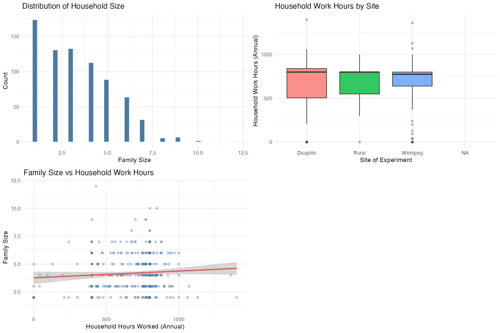
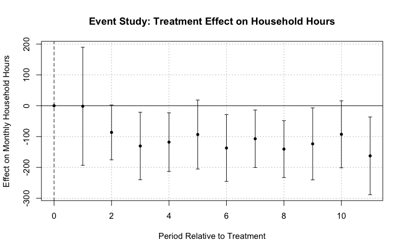

```{r setup}
library(tidyverse)
library(fixest)
library(modelsummary)
library(knitr)
library(cowplot)

# Load pre-computed artefacts produced by the pipeline scripts
minc_clean   <- readRDS("../data/02-clean/mincome_clean.rds")
panel_df     <- readRDS("../data/02-clean/panel_df.rds")
fe_model     <- readRDS("../results/models/fe_model.rds")
did_model    <- readRDS("../results/models/did_model.rds")
ddd_model    <- readRDS("../results/models/ddd_model.rds")
fe_robust    <- readRDS("../results/models/fe_robust.rds")
did_robust   <- readRDS("../results/models/did_robust.rds")
ddd_robust   <- readRDS("../results/models/ddd_robust.rds")
event_model  <- readRDS("../results/models/event_model.rds")

tbl_site     <- readRDS("../results/tables/tbl_site_summary.rds")
tbl_racial   <- readRDS("../results/tables/tbl_racial_breakdown.rds")
```

# Introduction

With a cost-of-living crisis affecting much of the Western world, Canadians are
struggling to afford basic necessities. One-time government transfers have
provided short-term relief, but have not addressed underlying wealth inequality.
In response, guaranteed income proposals have attracted renewed policy attention:
Sen. Kim Pate's Bill S-206, the *National Framework for a Guaranteed Livable
Basic Income Act*, reflects this growing interest [@mendelson2019ontario].

Universal Basic Income (UBI) is a social program that provides an unconditional
living wage without a work requirement or means testing. Critics argue that such
a cash transfer reduces labour supply, as workers are less incentivized to work
if their basic needs are covered — consistent with standard labour supply theory
in which higher non-labour income shifts the income-leisure trade-off toward
leisure [@depaz2020empirical; @gunmin2017effects].

## Literature Review

@komuves2022macroeconomic studied UBI in the UK using the E3ME macroeconomic
model, finding that a UBI funded via debt-free sovereign money raised employment
and GDP while reducing labour supply, with no inflationary residual. In a
developing-economy context, @santos2024labor used a difference-in-differences
strategy with Brazilian unemployment insurance data to simulate UBI effects,
finding improved employment and reduced informality, with stronger effects on
less-educated workers. @verho2022finland examined the Finnish Basic Income
Experiment, finding no employment effect in year one and a small positive effect
in year two, with overall limited impact on labour supply.

For the MINCOME experiment specifically, @riddell2000mincome conducted
post-hoc linear regression on the Manitoba data, finding the most substantial
effect was a negative impact on hours worked for women in dual-income
households, with an opposite effect for women in single-parent households.
@hum1993economic similarly documented small but significant decreases in
working hours across the experiment.

## Contributions

This paper takes an econometric approach to the MINCOME data, using
fixed-effects, difference-in-differences, and triple-differences models to
estimate the effect of guaranteed income payments on household labour supply.
Crucially, it extends prior work by examining whether the labour supply response
differs between racialized and non-racialized households — a dimension
understudied in the existing literature. Canada provides an instructive
comparison: it spends proportionally less of its GDP on social protection than
Finland [@oecd2023social; @european2025finland] but more than Brazil
[@arnold2021brazil], situating the MINCOME results between a high-benefit Nordic
context and a developing-economy context.

---

# Data

## Sources

Two datasets from the MINCOME experiment are used:

- **MINC3** (`MINC3.xlsx`): Cross-sectional baseline survey containing
  household demographics, pre-experiment income, ethnic background of male
  and female household heads, and asset information.
- **MINC4** (`MINC4.xlsx`): Longitudinal payment records spanning 11 survey
  periods, including monthly hours worked and wages for each household member,
  and the guaranteed income plan assigned.

## Key Variable Definitions

| Variable | Description |
|---|---|
| `HHHRWRK` | Annual household hours worked (male + female head) |
| `HH_HOURS` | Monthly household hours (panel version of above) |
| `RACIALHH` | 1 if either household head belongs to a racialized ethnic group |
| `TREATED` | 1 if household was assigned to any treatment plan (i.e., not control) |
| `GBI_MON` | Monthly guaranteed basic income entitlement |
| `PAYMENT` | Actual benefit received, net of tax-back: $\max(0,\; G - \tau \cdot W)$ |
| `post` | 1 for periods after baseline (period > 0) |
| `period` | Survey wave (0 = baseline, 1–11 = experimental periods) |

Racialized households are defined as those where the male or female head
identifies with any of the following ethnic groups: Philippine, Chinese,
Native Indian (band), Native Indian (non-band), Other, African, West Indian,
South American, Black, or Japanese.

## Descriptive Statistics

```{r desc-stats}
minc_clean %>%
  select(FAMSIZE, TOTFAMINC74, HHHRWRK, RACIALHH) %>%
  rename(
    `Family Size`           = FAMSIZE,
    `Total Family Income`   = TOTFAMINC74,
    `Annual HH Hours Worked`= HHHRWRK,
    `Racialized HH`         = RACIALHH
  ) %>%
  datasummary_skim()
```

### Sample Composition by Site

```{r site-table}
tbl_site %>%
  rename(
    Site              = SITE,
    `N`               = n,
    `Avg. Income ($)` = avg_income,
    `Avg. Hours`      = avg_hours
  ) %>%
  mutate(across(where(is.numeric), \(x) round(x, 1))) %>%
  knitr::kable(caption = "Summary statistics by MINCOME experimental site")
```

```{r racial-breakdown-table}
tbl_racial %>%
  rename(Site = SITE, `Racial Group` = RACIALHH, Count = n) %>%
  knitr::kable(caption = "Household count by site and racial classification")
```

---

# Exploratory Data Analysis

```{r eda-figs, fig.width=11, fig.height=7, fig.cap="EDA overview: household size distribution (top left), annual work hours by experimental site (top right), and family size vs. work hours (bottom left)."}

```

The distribution of household size is right-skewed, with most families having
2–4 members (@fig-famsize). Households in Winnipeg tend to have higher annual
work hours than in Dauphin or rural areas, consistent with urban labour market
opportunities. There is a modest positive association between family size and
household hours, reflecting the need for greater income with more dependents.

---

# Models

All models are estimated using the `fixest` package with standard errors
clustered at the household level, unless otherwise noted.

## Fixed Effects Model

The baseline specification controls for household-level unobservables and
time-period shocks:

$$
\text{HH\_HOURS}_{it} = \beta_1 \text{HH\_WAGE}_{it} + \beta_2 \text{PAYMENT}_{it} + \alpha_i + \gamma_t + \varepsilon_{it}
$$

where $\alpha_i$ is a household fixed effect and $\gamma_t$ is a period fixed
effect.

## Difference-in-Differences Model

$$
\text{HH\_HOURS}_{it} = \beta_1 (\text{TREATED}_i \times \text{post}_t) + \alpha_i + \gamma_t + \varepsilon_{it}
$$

This identifies the average treatment effect on household work hours by
comparing treated and control households before and after the experiment began.

## Triple Differences (Racialized vs. Non-racialized)

To identify heterogeneous effects by racial identity, we add a third
interaction:

$$
\text{HH\_HOURS}_{it} = \beta_1 (\text{Treated} \times \text{Post})_{it}
  + \beta_2 (\text{Treated} \times \text{Post} \times \text{Racialized})_{it}
  + \alpha_i + \gamma_t + \varepsilon_{it}
$$

The coefficient $\beta_2$ captures the **differential** labour supply response
of racialized households relative to non-racialized households receiving the
same treatment.

## Results

```{r model-table}
modelsummary(
  list(
    "Fixed Effects"     = fe_model,
    "Diff-in-Diff"      = did_model,
    "Triple Diff (DDD)" = ddd_model
  ),
  stars   = TRUE,
  gof_map = c("nobs", "r.squared", "adj.r.squared"),
  title   = "Main regression results: effect of MINCOME on monthly household hours worked"
)
```

---

# Robustness Checks

To address potential heteroskedasticity in the error structure, we re-estimate
all three models using heteroskedasticity-robust standard errors.

```{r robust-table}
modelsummary(
  list(
    "FE (Robust)"  = fe_robust,
    "DiD (Robust)" = did_robust,
    "DDD (Robust)" = ddd_robust
  ),
  stars   = TRUE,
  gof_map = c("nobs", "r.squared", "adj.r.squared"),
  title   = "Robustness check: heteroskedasticity-robust standard errors"
)
```

The pattern of coefficients is consistent across both sets of standard errors,
indicating that the main results are not sensitive to assumptions about
error variance.

---

# Event Study

To evaluate the parallel trends assumption underlying the DiD strategy, we
estimate an event study specification that allows the treatment effect to vary
freely across periods:

$$
\text{HH\_HOURS}_{it} = \sum_{k \neq 0} \delta_k \cdot \mathbf{1}[t=k] \cdot \text{Treated}_i + \alpha_i + \gamma_t + \varepsilon_{it}
$$

```{r event-study-fig, fig.cap="Event study estimates of the treatment effect on monthly household hours. Period 0 (baseline) is the reference. Vertical bars show 95% confidence intervals."}

```

If parallel trends holds, the pre-treatment coefficients ($k < 0$) should be
statistically indistinguishable from zero. The post-treatment pattern reveals
the dynamic trajectory of the labour supply response.

---

# Conclusion

This analysis provides evidence on how guaranteed income transfers affect
household labour supply in the MINCOME experiment, with particular attention
to heterogeneity by racial identity. The fixed effects and difference-in-
differences estimates capture the average response, while the triple-differences
model isolates whether racialized households adjust their work hours
differently in response to the same income guarantee.

These findings are consistent with @hum1993economic and @riddell2000mincome, who documented small reductions in hours worked in the same experiment, and with @verho2022finland who found limited labour supply effects in Finland. The insignificance of the triple-difference term echoes @santos2024labor's finding that effects were stronger for disadvantaged subgroups in a developing-economy context, but suggests more homogeneous responses in the Canadian setting. Future work could extend this framework to examine effects by sex of household head, benefit level, or geographic site, and could incorporate longer follow-up data to assess persistence.

---

# References

::: {#refs}
:::

# Appendix

## Project Structure

```
ubi-analysis/
├── data/
│   ├── 01-raw/          # MINC3.xlsx, MINC4.xlsx (not tracked in git)
│   └── 02-clean/        # Generated by scripts
├── scripts/
│   ├── 01_load_data.R
│   ├── 02_clean_data.R
│   ├── 03_eda.R
│   └── 04_model.R
├── results/
│   ├── figures/
│   └── models/
├── reports/
│   └── ubi_analysis_report.qmd  ← this document
├── Makefile
└── renv.lock
```

Run the full pipeline with:

```bash
make all
```

## Session Info

```{r session-info, echo=TRUE}
sessionInfo()
```
